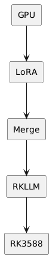
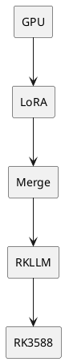

# Advanced Example: LoRA vs RAG on RK3588

## Important Limitation

A real LoRA requires trainable adapter weights.

So a true LoRA cannot be completely "fileless" if you want persistence.

However, you can demonstrate LoRA concepts using a tiny in-memory dataset.

## Tiny Dataset

```python
dataset = [
    {"instruction": "Who is ambu?", "answer": "Ambu is a poet."},
    {"instruction": "What is RK3588?", "answer": "RK3588 is a Rockchip SoC."}
]
```

## Minimal PEFT LoRA Example

```python
from datasets import Dataset
from transformers import AutoModelForCausalLM, AutoTokenizer
from peft import LoraConfig, get_peft_model

dataset = Dataset.from_list([
    {"text": "Question: Who is ambu? Answer: Ambu is a poet."},
    {"text": "Question: What is RK3588? Answer: RK3588 is a Rockchip SoC."}
])

model = AutoModelForCausalLM.from_pretrained("Qwen/Qwen2.5-0.5B")

config = LoraConfig(
    r=8,
    lora_alpha=16,
    target_modules=["q_proj", "v_proj"]
)

model = get_peft_model(model, config)
```

## RAG vs LoRA

| Feature | RAG | LoRA |
|----------|----------|----------|
| Adds knowledge | Yes | Yes |
| Training required | No | Yes |
| Easy updates | Yes | No |
| Good for style | Moderate | Excellent |
| Good for facts | Excellent | Moderate |

## Recommended RK3588 Pipeline  




## Recommendation

Use:

1. RAG for knowledge and documents.
2. LoRA for style, persona, and behavior.
3. Convert the merged model to RKLLM.
4. Deploy on RK3588.
