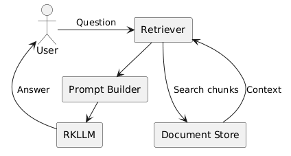
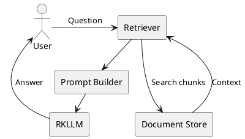

# RKLLM + Xeus-C++ (xcpp) on RK3588: Developer Notes

## Goal

Run RKLLM models from a Jupyter notebook using the Xeus-C++ (`xcpp`)
kernel on RK3588.

Tested components:

-   RK3588
-   RKLLM Runtime 1.2.3
-   RKNN Driver 0.9.8
-   Qwen3-4B-W8A8 RKLLM model
-   xcpp (LLVM/ORC JIT)
-   Micromamba environment

------------------------------------------------------------------------

# Problem 1: Header Not Found

Code:

``` cpp
#include "rkllm.h"
```

Error:

``` text
fatal error: 'rkllm.h' file not found
```

Root cause:

The include path was not configured for xcpp.

Solution:

Add the RKLLM include directory to the kernel specification.

Example:

``` json
"-I",
"/home/milh/projects/rknn-llm/rkllm-runtime/Linux/librkllm_api/include"
```

Kernel file:

``` text
/home/milh/micromamba/envs/xeus-cpp/share/jupyter/kernels/xcpp23/kernel.json
```

------------------------------------------------------------------------

# Problem 2: Shared Library Loading

RKLLM runtime:

``` text
librkllmrt.so
```

Location:

``` text
/home/milh/projects/rknn-llm/rkllm-runtime/Linux/librkllm_api/aarch64
```

Kernel configuration:

``` json
"env": {
  "LD_LIBRARY_PATH":
  "/home/milh/projects/rknn-llm/rkllm-runtime/Linux/librkllm_api/aarch64"
}
```

Verification:

``` bash
ldd librkllmrt.so
```

Expected:

No

``` text
not found
```

entries.

------------------------------------------------------------------------

# Problem 3: rkllm.h Uses size_t Without Including It

Error:

``` text
unknown type name 'size_t'
```

Root cause:

`rkllm.h` uses `size_t` but does not include the required standard
header.

Workaround:

``` cpp
#include <stddef.h>
#include "rkllm.h"
```

Recommended fix:

Patch `rkllm.h`:

``` cpp
#include <stddef.h>
```

near the top of the file.

------------------------------------------------------------------------

# Problem 4: ORC JIT Cannot Resolve RKLLM Symbols

Error:

``` text
Symbols not found:
rkllm_createDefaultParam
rkllm_init
rkllm_run
```

Even after:

``` json
"-L",
".../aarch64",
"-lrkllmrt"
```

Root cause:

xcpp uses LLVM ORC JIT.

The shared library is loaded by the operating system but ORC does not
automatically import symbols into notebook code.

------------------------------------------------------------------------

# Verification

The library loads correctly:

``` cpp
#include <dlfcn.h>

void* lib = dlopen(
"/home/milh/projects/rknn-llm/rkllm-runtime/Linux/librkllm_api/aarch64/librkllmrt.so",
RTLD_NOW | RTLD_GLOBAL);
```

Result:

``` text
loaded
```

Exported symbol:

``` cpp
dlsym(lib, "rkllm_createDefaultParam")
```

Result:

``` text
0xffff...
```

This proves:

-   RKLLM library is valid
-   Symbols are exported
-   Driver is functioning

------------------------------------------------------------------------

# Final Solution

Use:

``` cpp
dlopen()
```

plus

``` cpp
dlsym()
```

instead of directly calling RKLLM functions.

Example:

``` cpp
using CreateDefaultParamFn = RKLLMParam (*)();

auto rkllm_createDefaultParam_fn =
reinterpret_cast<CreateDefaultParamFn>(
    dlsym(lib, "rkllm_createDefaultParam"));
```

Then:

``` cpp
RKLLMParam param =
    rkllm_createDefaultParam_fn();
```

The same approach works for:

``` text
rkllm_init
rkllm_run
rkllm_destroy
```

------------------------------------------------------------------------

# Working Inference Pipeline

1.  Load RKLLM runtime

``` cpp
dlopen(...)
```

2.  Resolve symbols

``` cpp
dlsym(...)
```

3.  Initialize model

``` cpp
rkllm_init_fn(...)
```

4.  Create prompt

``` cpp
RKLLMInput
```

5.  Run inference

``` cpp
rkllm_run_fn(...)
```

6.  Stream output through callback

7.  Cleanup

``` cpp
rkllm_destroy_fn(...)
```

------------------------------------------------------------------------

# Successful Output

Model:

``` text
Qwen3-4B-w8a8-npu.rkllm
```

Output:

``` text
Hello, world! How can I assist you today?
```

and

``` text
RK3588, next-gen core,
powerful, efficient, bright future—
innovation reborn.
```

------------------------------------------------------------------------

# Simple RAG Architecture

Implemented without:

-   FAISS
-   Chroma
-   PostgreSQL
-   Elasticsearch
-   Milvus

Architecture:  




Flow:

1.  Store documents in memory.
2.  Retrieve matching chunks.
3.  Build prompt.
4.  Send prompt to RKLLM.
5.  Return grounded answer.

------------------------------------------------------------------------

# Lessons Learned

1.  RKLLM runtime works correctly on RK3588.
2.  xcpp can load RKLLM.
3.  `rkllm.h` is not fully self-contained.
4.  LLVM ORC JIT does not automatically expose RKLLM symbols.
5.  `dlopen + dlsym` is the most reliable integration strategy.
6.  Simple RAG can be built entirely in memory without a database.

------------------------------------------------------------------------

# Recommended Next Steps

-   TF-IDF retrieval
-   Embedding generation
-   FAISS vector index
-   Hybrid retrieval
-   Multi-document RAG
-   PDF ingestion
-   Local knowledge base search
